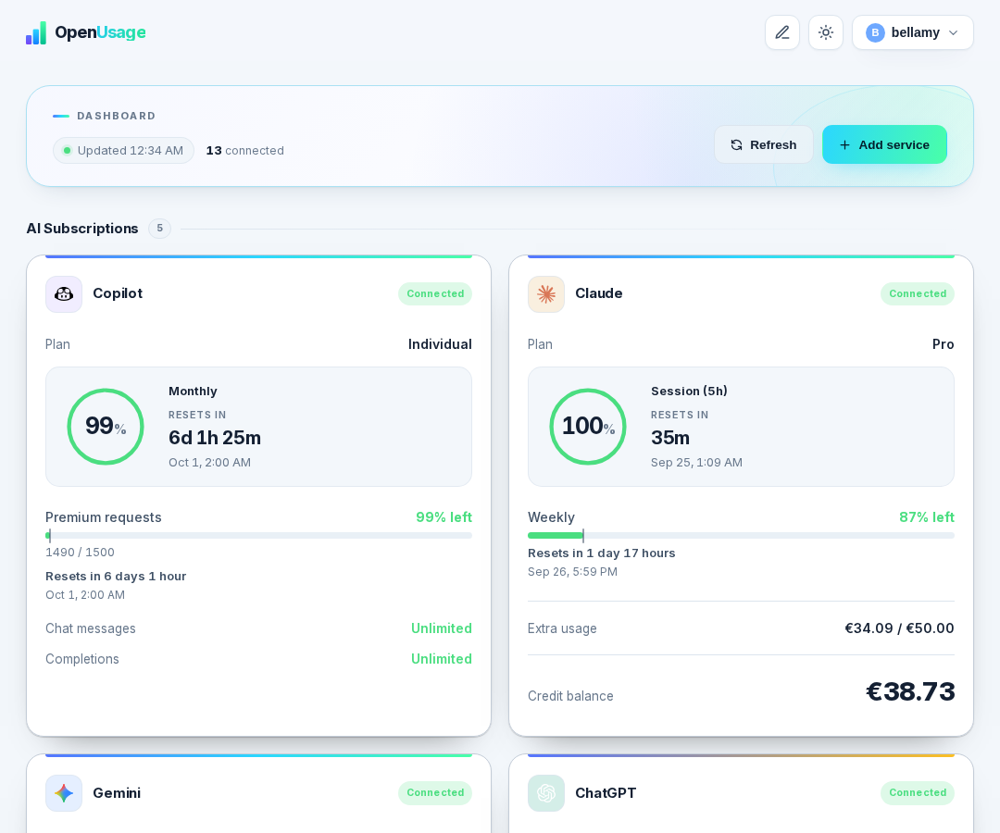
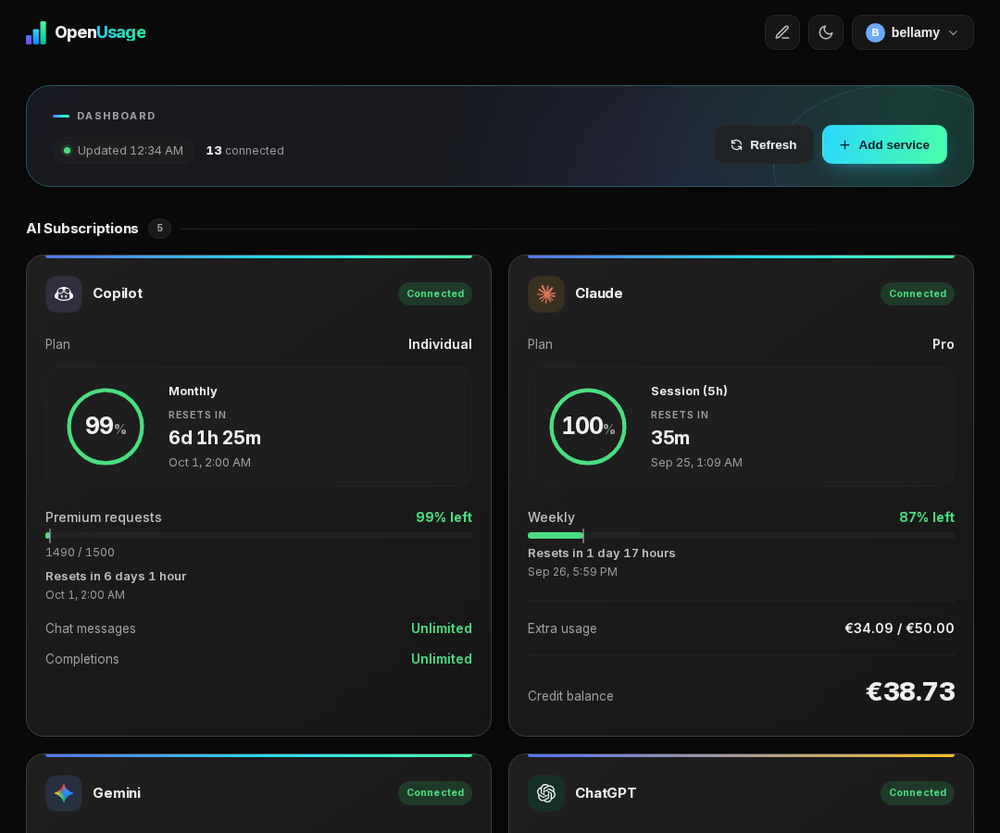
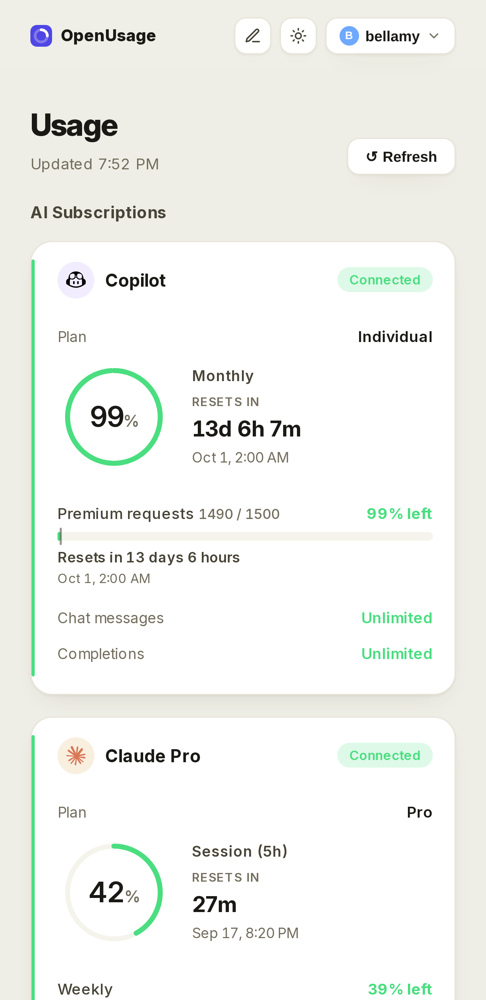
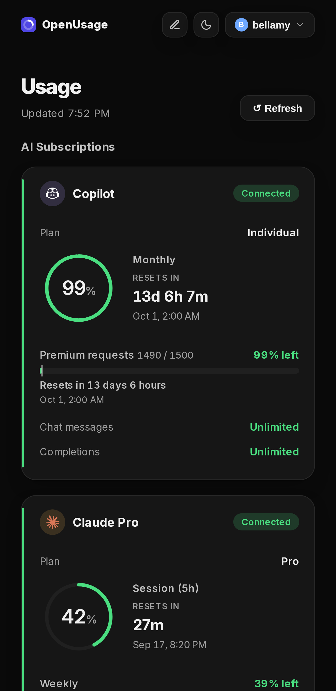

<p align="center">
  
</p>

<h1 align="center">OpenUsage</h1>

<p align="center">
  A self-hosted dashboard for monitoring usage, quotas, balances, and spend across your AI providers.
</p>

<p align="center">
  <a href="https://github.com/ellite/openusage/stargazers"></a>
  <a href="https://hub.docker.com/r/bellamy/openusage"></a>
  <a href="https://github.com/ellite/openusage/graphs/contributors"></a>
  <a href="https://github.com/sponsors/ellite"></a>
  <a href="https://github.com/ellite/openusage/releases/latest"></a>
  <a href="https://github.com/ellite/openusage/actions/workflows/release.yml"></a>
</p>

## Table of Contents

- [Features](#features)
- [Screenshots](#screenshots)
- [Supported Providers](#supported-providers)
- [Getting Started](#getting-started)
- [Configuration](#configuration)
- [Push Notifications](#push-notifications)
- [Adding a Provider](#adding-a-provider)
- [Data and Security](#data-and-security)
- [Architecture](#architecture)
- [Development](#development)

## Features

- Monitor AI usage from one dashboard.
- Connect multiple instances of each supported provider, such as personal and work accounts.
- Refresh usage on demand, with cached results retained when a provider is temporarily unavailable.
- Refresh connected providers in the background every five minutes.
- Create and manage local user accounts, with optional OIDC/SSO sign-in, email-based password reset, and TOTP two-factor authentication.
- Receive optional browser push notifications when a configured service crosses a usage threshold.
- Install the frontend as a progressive web app (PWA).

## Screenshots



<details>
<summary>View more screenshots</summary>

**Dashboard (dark)**


**Dashboard (mobile)**


**Dashboard (mobile, dark)**


</details>

## Supported Providers

| Provider | Reported data | Connection method |
| --- | --- | --- |
| Claude | Usage limits, plan, and prepaid-credit balance when available | Browser cURL import |
| Google Gemini | Session and weekly usage limits | Browser cURL import |
| ChatGPT | Plan, subscription status, and Codex usage windows when available | Browser cURL import |
| DeepSeek | Account balance | API key |
| GitHub Copilot | Plan, quota reset date, premium requests, chat, and completions | GitHub device login or token |
| OpenAI | Current-month organization spend, optionally credit balance and subscription details | Admin API key, with optional browser-session import |
| Ollama Cloud | Account balance, free-usage percentage, and reset time | Browser cURL import |
| Custom API | Any fields you pick from a JSON response, for providers with no dedicated integration | Your own URL/method/headers/body |

Provider integrations that use browser sessions or undocumented endpoints can change as providers update their services. Reconnect the provider from **Settings** if its session expires.

## Getting Started

### Prerequisites

- [Docker](https://docs.docker.com/get-docker/) and [Docker Compose](https://docs.docker.com/compose/install/)
- A browser to complete provider sign-in or capture cURL requests where required

> Images are hosted on **Docker Hub** (`bellamy/openusage`). A mirror is also available on GHCR (`ghcr.io/ellite/openusage`) if you prefer.

### Docker Compose

1. Download the compose file:

```bash
curl -o docker-compose.yml https://raw.githubusercontent.com/ellite/openusage/main/docker-compose.yml
```

2. Generate a secret key and set it in `docker-compose.yml`:

```bash
# Python
python3 -c "import secrets; print(secrets.token_hex(32))"

# OpenSSL
openssl rand -hex 32
```

```yaml
services:
  openusage:
    image: bellamy/openusage:latest
    container_name: openusage
    restart: unless-stopped
    ports:
      - "4188:8000"
    environment:
      - PUID=1000
      - PGID=1000
      - TZ=UTC
      - ENABLE_ACCOUNT_CREATION=true
      - SECRET_KEY=changeme   # ← generate with: openssl rand -hex 32
    volumes:
      - ./data:/app/data
```

3. Start:

```bash
docker compose up -d
```

### Docker Run

```bash
docker run -d \
  --name openusage \
  --restart unless-stopped \
  -p 4188:8000 \
  -e PUID=1000 \
  -e PGID=1000 \
  -e TZ=UTC \
  -e ENABLE_ACCOUNT_CREATION=true \
  -e SECRET_KEY="$(openssl rand -hex 32)" \
  -v ./data:/app/data \
  bellamy/openusage:latest
```

### First Setup

1. Open [http://localhost:4188](http://localhost:4188) in your browser.
2. Register an account - all data is local to your instance.
3. Add a provider from **Settings**.
4. Once you've created the accounts you need, set `ENABLE_ACCOUNT_CREATION=false` and restart (`docker compose up -d`) to close off further registration.

### Updating

```bash
docker compose pull && docker compose up -d
```

## Configuration

The application reads the following environment variables:

| Variable | Default | Description |
| --- | --- | --- |
| `PUID` | `1000` | User ID the container runs as. Match it to the owner of the `./data` directory on the host. |
| `PGID` | `1000` | Group ID the container runs as. |
| `TZ` | `UTC` | IANA timezone name (e.g. `America/New_York`), applied to the container so logs and timestamps show local time. |
| `ENABLE_ACCOUNT_CREATION` | `true` | Allows new local accounts to be registered. Set to `false` after creating the accounts you need. |
| `DB_PATH` | `/app/data/openusage.db` | Path to the SQLite database inside the container. |
| `SECRET_KEY` | `change-me-in-production` | Used to encrypt two-factor secrets at rest. Set this to a long random value in production. |
| `SERVER_URL` | `http://localhost:8000` | Public URL of this instance, used to build password-reset email links. |
| `SMTP_ADDRESS` | - | SMTP server hostname. Password reset is disabled until this is set. |
| `SMTP_PORT` | `587` | SMTP server port. |
| `SMTP_ENCRYPTION` | `tls` | `tls`, `ssl`, or `none`. |
| `SMTP_USERNAME` | - | SMTP username, if the server requires authentication. |
| `SMTP_PASSWORD` | - | SMTP password. |
| `FROM_EMAIL` | - | "From" address on password-reset emails. Falls back to `SMTP_USERNAME`. |
| `OIDC_ENABLED` | `false` | Enables "Sign in with SSO" on the login page. |
| `OIDC_PROVIDER_NAME` | `SSO` | Label shown on the sign-in button. |
| `OIDC_CLIENT_ID` | - | OAuth2 client ID from your identity provider. |
| `OIDC_CLIENT_SECRET` | - | OAuth2 client secret. |
| `OIDC_AUTH_URL` | - | Provider's authorization endpoint. |
| `OIDC_TOKEN_URL` | - | Provider's token endpoint. |
| `OIDC_USERINFO_URL` | - | Provider's userinfo endpoint. |
| `OIDC_REDIRECT_URL` | `http://localhost:8000/api/oidc/callback` | Must point at this app's `/api/oidc/callback`. |
| `OIDC_IDENTIFIER_FIELD` | `email` | Userinfo field used to match/create the local account. |
| `OIDC_SCOPES` | `openid email profile` | OAuth2 scopes requested. |
| `OIDC_AUTO_CREATE_USERS` | `true` | Creates a local account on first SSO login if none matches. |
| `OIDC_DISABLE_PASSWORD_LOGIN` | `false` | Hides the username/password form, making SSO the only way in. |
| `VAPID_PUBLIC_KEY` | - | Public VAPID key used when browsers subscribe to push notifications. |
| `VAPID_PRIVATE_KEY` | - | Private VAPID key used to sign push notifications. Keep this secret. |
| `VAPID_SUBJECT` | `mailto:admin@example.com` | Contact URI sent to push services. Use a valid `mailto:` or HTTPS URI. |

Add any of these to the `environment:` block in `docker-compose.yml`, then apply changes with:

```bash
docker compose up -d
```

## Push Notifications

OpenUsage can send browser push notifications when a service crosses one of its configured usage thresholds. Push notifications remain disabled until the server has a VAPID key pair and a user enables them on a device.

Web Push requires a secure context. Serve OpenUsage over HTTPS in production; browsers generally make an exception only for `localhost` during local development.

### Generate VAPID keys

If OpenUsage is already running with Docker Compose, generate a key pair inside the container:

```bash
docker exec openusage python /app/scripts/generate_vapid_keys.py
```

For a native development installation, run the script with the backend virtual environment instead:

```bash
cd backend
.venv/bin/python scripts/generate_vapid_keys.py
```

The script prints a private and public key. Save them in the repository-root `.env` file, along with a contact address for your server:

```env
VAPID_PRIVATE_KEY=generated-private-key
VAPID_PUBLIC_KEY=generated-public-key
VAPID_SUBJECT=mailto:you@example.com
```

For Docker Compose, pass those values through the `environment` section of the `openusage` service:

```yaml
environment:
  - VAPID_PRIVATE_KEY=${VAPID_PRIVATE_KEY}
  - VAPID_PUBLIC_KEY=${VAPID_PUBLIC_KEY}
  - VAPID_SUBJECT=${VAPID_SUBJECT}
```

Then recreate the application container:

```bash
docker compose up -d openusage
```

If you use `docker run`, pass the same variables with `--env-file .env` or individual `-e` options. For a native installation, restart the backend after updating `.env`.

Keep the private key secret and preserve the same key pair across upgrades and container recreations. Replacing it invalidates existing browser subscriptions, so every device would need to enable notifications again.

### Enable a device and configure alerts

1. Open **Settings → Push Notifications**.
2. Select **Enable on this device** and allow notifications when the browser asks.
3. Use **Send test notification** to verify delivery.
4. Add or edit a service and set the notification thresholds you want for that provider.

Each browser or device must be enabled separately. A notification is sent once when usage crosses a threshold; it is automatically armed again after usage drops below that threshold following a reset.

## Adding a Provider

1. Sign in to OpenUsage and open **Settings**.
2. Select **Add Service**, choose a provider, and give the connection a descriptive name.
3. Enter the required credential or use the supplied cURL-import/device-login flow.
4. Save the service, then return to the dashboard and select **Refresh**.

For Claude, Gemini, and OpenAI session imports, capture a request in your browser's developer tools while signed in to the provider. Paste the complete cURL command into the relevant import field; OpenUsage extracts only the values needed for that integration.

### Gemini sessions that repeatedly expire

Use a fresh Gemini sign-in in **Firefox** when importing cookies for unattended use. Recent Chromium-based browsers can create device-bound Google sessions: copied cookies work temporarily, but OpenUsage cannot supply the original browser's device proof to renew them. Repeatedly importing from that same session does not address this limitation. This behavior and the Firefox workaround are also documented by [Gemini-API](https://github.com/HanaokaYuzu/Gemini-API#authentication).

OpenUsage attempts cookie renewal during background refreshes and persists issued cookies. A successful HTTP response from Google's `RotateCookies` endpoint alone does not prove renewal: updates to `SIDCC` cookies without a new `__Secure-1PSIDTS` can leave the authentication session expired. The logs distinguish those outcomes. A fresh page token or copying the same cookies into a new headless browser cannot guarantee recovery of a device-bound session.

If a future release changes this behavior, pull it with `docker compose pull && docker compose up -d`; restarting the existing container alone does not fetch a newer image.

#### Gemini refresh diagnostics

Follow refresh attempts with `docker compose logs -f --since 30m openusage | grep 'Gemini refresh'`.
Each JSON event includes an `attempt` ID, `service_id`, elapsed milliseconds, `stage`, and `outcome`.
Stages distinguish cookie rotation, saving credentials, fetching page tokens, and the usage RPC (including retries).

- `auth_cookie_renewed: true` means Google issued a changed `__Secure-1PSIDTS`. A subsequent `persistence` / `saved` event confirms the credentials were saved; `fetch` / `ok` confirms usage retrieval.
- `no_auth_cookie_change_reason_unspecified` means Google did not supply a changed authentication cookie and did not provide a reason we can identify. It does **not** prove device binding or expiry by itself.
- HTTP status, numeric `Retry-After`, timeout/connection exception type, page redirect category, token presence, and numeric RPC errors identify where a failure occurred. For example, RPC code 7 means permission denied; it does not explain Google's underlying authentication decision.
- `google_di_raw` and `google_hfcr_raw` retain only Google's numeric rotation diagnostic fields. Their meanings are not inferred. Arbitrary response bodies, cookie/token values, and full URLs containing session IDs are excluded.

Diagnostics use the existing container logs and remain subject to Docker's configured log retention. No separate credential-bearing debug dump is created.

## Data and Security

- OpenUsage is intended to be self-hosted. Do not expose it directly to the public internet without placing it behind TLS and access controls.
- Provider credentials, session cookies, and service configuration are stored in the local SQLite database at `data/openusage.db`.
- Local account passwords are stored as PBKDF2-SHA256 hashes; active sessions expire after 30 days.
- Back up `data/openusage.db` if you want to retain accounts, provider connections, and cached usage history across host migrations.
- Treat database backups and browser cURL commands as sensitive, because they can contain provider credentials.

## Architecture

```text
Browser / PWA
      |
      v
FastAPI (:8000, single container)
      |
      +-- Serves the built Astro static site
      |
      +-- /api/ routes
      |     |
      |     +-- SQLite data store
      |     +-- Provider APIs and browser-session endpoints
```

- The frontend is an Astro static site built at image-build time and served directly by FastAPI via `StaticFiles`.
- The same FastAPI process handles `/api/` routes and static asset serving, so there is only one container and no internal proxy.
- The backend caches successful provider responses and refreshes all configured services every five minutes.

## Development

<details>
<summary>View instructions</summary>

The repository is organized as:

```text
backend/   FastAPI application, provider fetchers, and SQLite access
frontend/  Astro application, static build, no server-side runtime
data/      Persistent SQLite data
```

### Requirements

- Python 3.12+
- Node.js 20+

### Backend

```bash
cp .env.example .env   # in the repo root - then edit .env, at minimum set SECRET_KEY
cd backend
python3 -m venv .venv && .venv/bin/pip install -r requirements.txt
.venv/bin/uvicorn main:app --reload --host 0.0.0.0 --port 4188
```

### Frontend

```bash
cd frontend
npm install
npm run dev
```

The frontend dev server starts on `http://localhost:4321` and proxies `/api/*` calls to the backend on port `4188` (override with `BACKEND_URL=http://localhost:PORT npm run dev`). `docker-compose.yml` is the production deployment example, not the dev loop — run the backend and frontend natively as above instead.

</details>
